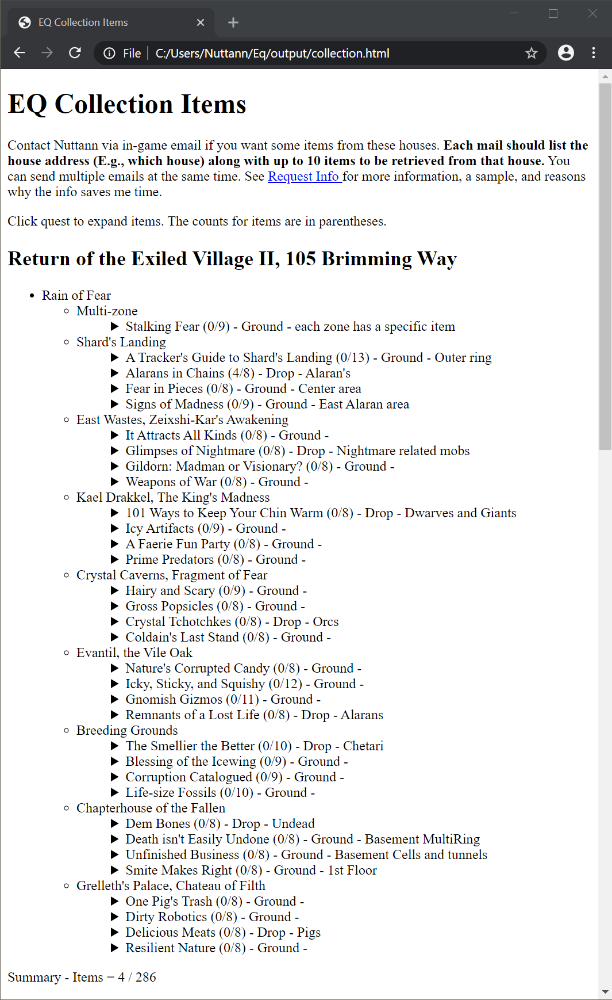
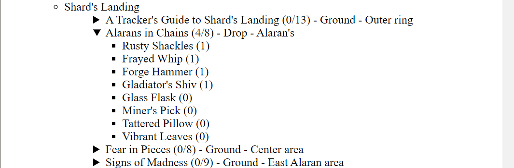

# Output description for collectstoweb program

This is a detailed description of the HTML output produced by collectstoweb. The
following screenshots are from a **practically empty house**, but should be
enough to describe how to read the output. Some may be intuitive, but some of
the numbers are less clear to some people.

Here is the beginning of a file showing a whole house that is configured to
a portion of the Rain of Fear collection items.

The "EQ Collection Items" line at the top is the title defined by the
"htmltitle" entry in the configuration file.

The paragraph below that is the custom introduction defined by the "htmlintro"
entry in the configuration file.

The "Click quest to expand ..." line is always output.

The line "Return of the Exiled Village II, 105 Brimming Way" is the address of
the house configured to contain the items listed below it.

The lines between the address and the "Summary - Items = " line at the end is
the listing of the items for the configured quests.

The left column (E.g., "Rain of Fear") are the expansions or pseudo expansions
configured for house. There is only one in this particular house. In fact, only
part of Rain of Fear is configured for this house.

The 2nd column (E.g., "Shard's Landing) are the zones or pseudo zones from the
expansion that they are under.

The 3rd column contains quest names and related info for collection quests from
the zone that they are under. There are three parts to these lines:

- Quest name (E.g., "Alarans in Chains")
- Number of quest items in house out of number of total items (E.g. "(4/8)")
  This example means that there are 8 total items in the quest and 4 of them are
  in the house.
- Notes about the quest such as drop or ground spawns and any details known
  (E.g., "Drop - Alarans")

The triagle at the beginning of the line indicates that this line can be clicked
on it to expand for more details. Clicking on the "Alarans in Chains" line
expands it as shown in the picture below.

This expanded view of a quest shows all items in the quest and the number of
that item in the house. In this example, there is one of each of the first four
items. If the name of an item in not in the item DB, then "???" is replaced as
the name. Names will eventually be picked up as they are gathered from
real-estate dumps configured to hold collection items. Clicking the quest line
again will collapse the quest back to the original view.
